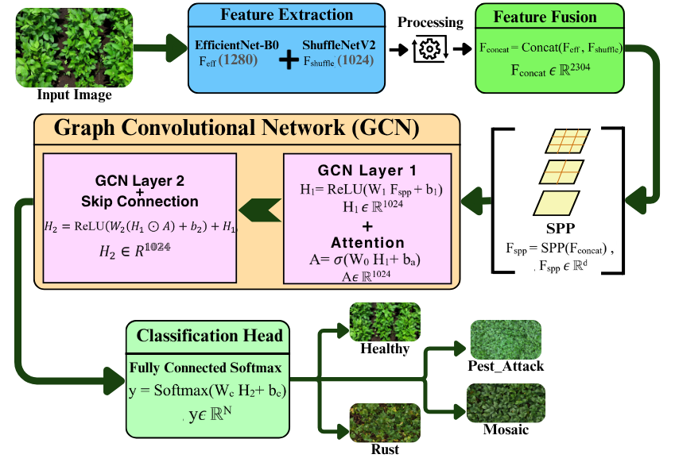
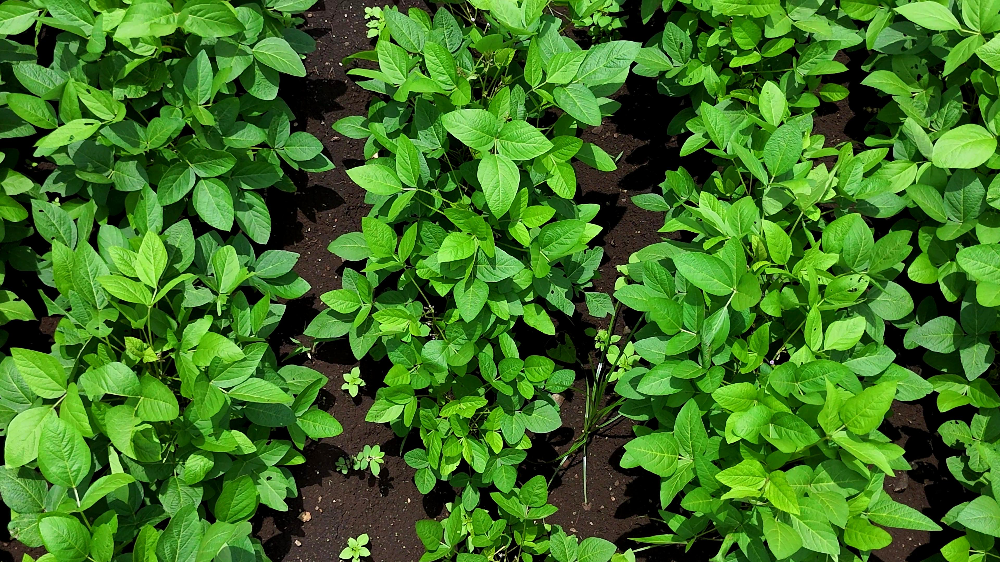
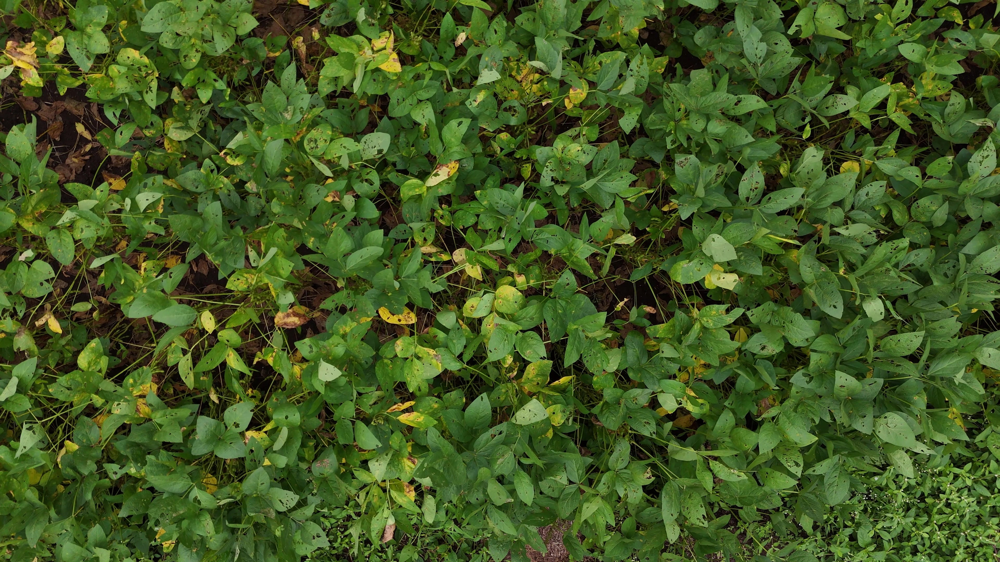
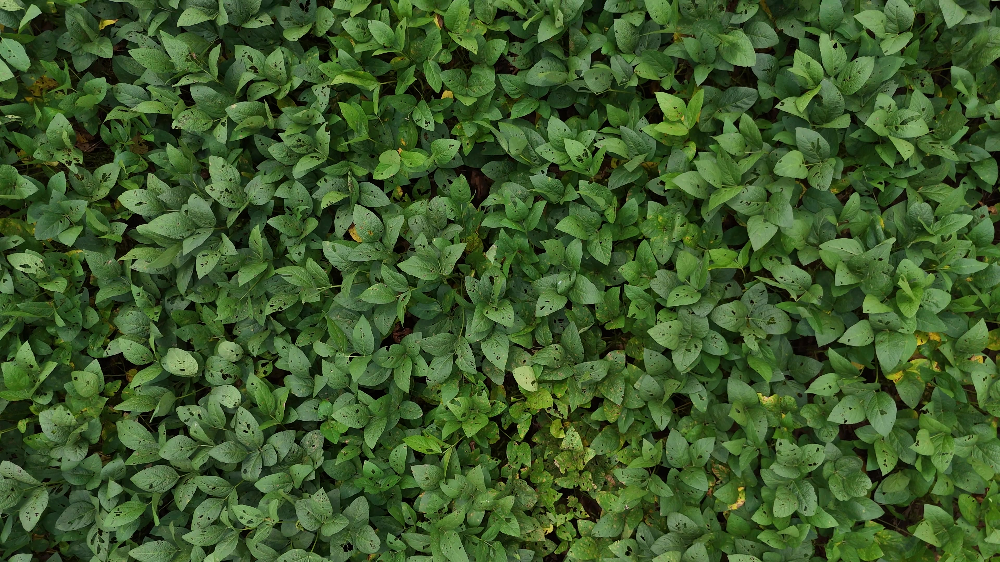
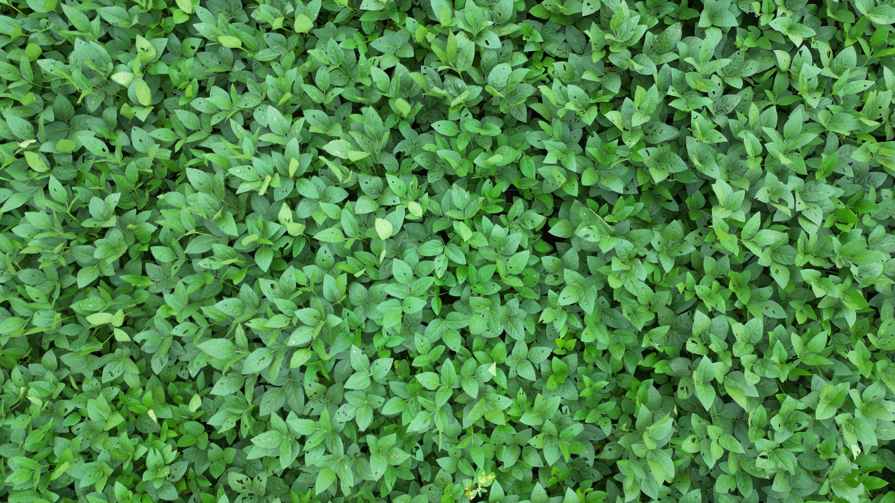
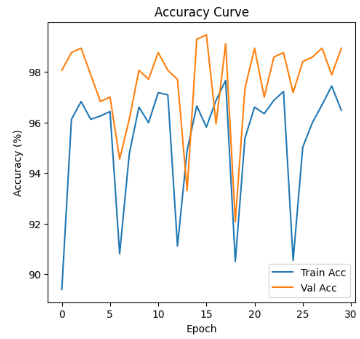
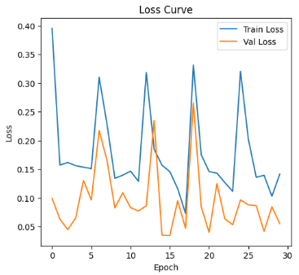
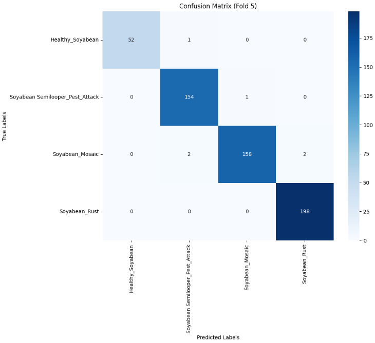
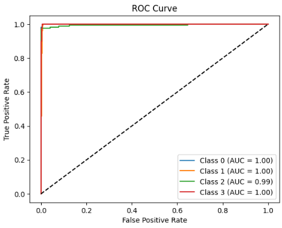
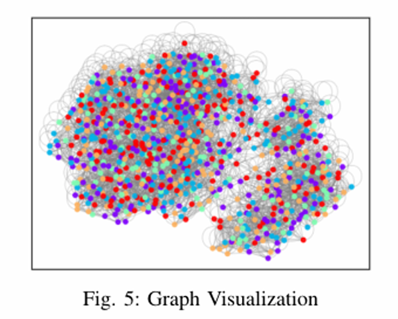

<h1 > 🌿 Attention-Enhanced GCN with SPP for
 UAV-Captured Plant Imagery </h1>

In precision agriculture, early and accurate detection of crop diseases is vital for increasing yield and minimizing losses. Traditional deep learning models such as CNNs often overlook spatial and topological relationships in plant structures, especially in high-resolution UAV-captured images.

This project proposes a novel pipeline that integrates **Attention-enhanced Graph Convolutional Networks (GCNs)** with **Spatial Pyramid Pooling (SPP)** to improve plant disease classification from drone-captured soybean leaf images. The proposed model leverages:

- **Graph-based representation of leaf images**, converting superpixel segments into nodes and using their connectivity as edges,
- **Multi-head attention** to enhance feature extraction by focusing on critical disease patterns,
- **SPP blocks** to capture multi-scale spatial features, ensuring robustness across different plant image resolutions.
---

## 🧾 Project Overview
<div style="width:100%; overflow-x:auto; margin:1em 0; font-family:Arial, sans-serif;">

| Attribute       | Description                                                                 |
|-----------------|-----------------------------------------------------------------------------|
| **📚 Framework** | PyTorch, PyTorch Geometric, Scikit-learn                                   |
| **🧠 Models Used** | Graph Convolutional Network (GCN), Relational GCN                          |
| **📷 Input Format** | Drone-captured Images (~256×256 px)                                      |
| **🎯 Output**   | 4-Class Image Classification                                               |
| **🧪 File**     | `gcn-code.ipynb`                                                           |
| **📁 Dataset Source** | [Soybean Leaf Dataset (Kaggle)](https://data.mendeley.com/datasets/hkbgh5s3b7/1) |

</div>

---
## 🌿 Workflow Diagram
The model begins by taking an input image and extracting features using two lightweight convolutional neural network backbones: EfficientNet-B0 and ShuffleNetV2, which generate feature vectors of dimensions 1280 *1024 respectively. These features are then combined through concatenation to form a single fused feature vector. This fused vector is passed through a Spatial Pyramid Pooling (SPP) layer, which transforms it into a fixed-size feature representation. The resulting vector is fed into the first layer of a Graph Convolutional Network (GCN), which computes intermediate feature representations. These intermediate features are further refined using an attention mechanism that highlights the most important information. In the second GCN layer, the model combines the attention-enhanced features with the earlier intermediate features using element-wise operations, activation functions, and a skip connection to retain useful information from previous layers. The final set of features is passed to a fully connected layer with a softmax activation function to classify the image into one of four categories: Healthy, Pest Attack, Rust, or Mosaic.





---


## 🗂 Dataset Overview

This dataset includes drone-captured images of soybean plants from various growth stages, classified into four types based on the disease:

<h3 >📊 Class Distribution</h3>

<table >
  <tr>
    <td align="center"></td>
    <td align="center"></td>
    <td align="center"></td>
    <td align="center"></td>
  </tr>
  <tr>
    <td align="center"><b>Healthy</b></td>
    <td align="center"><b>Rust</b></td>
    <td align="center"><b>Mosaic</b></td>
    <td align="center"><b>Pest</b></td>
  </tr>
</table>

- Total Images: ~1,000+  
- Format: `.jpg`  
- Structure: Class-wise folders  
- Preprocessing: Resizing, patch extraction, graph construction  

---

## 🧪 Notebook Workflow
<div>
  
| Step                | Description                                                                 |
|---------------------|-----------------------------------------------------------------------------|
| 📥 Data Loading      | Dataset parsed and structured into graph format                             |
| 🧼 Preprocessing      | Image → Superpixels → Graph (nodes/edges)                                  |
| 🧠 Model              | R-GCN architecture using PyTorch Geometric                                  |
| 🔁 Training           | CrossEntropyLoss + Adam optimizer                                           |
| 📊 Evaluation         | Accuracy, Confusion Matrix, ROC-AUC, Graph Visuals                          |
| 🔍 Inference          | Predict class for new images using trained GCN                             |

</div>

---

<h2>⚙️ Model Configuration &nbsp;&nbsp;&nbsp;&nbsp;&nbsp; 📈 Performance Summary</h2>
<div>
<table>
  <tr>
    <td>

<!-- Left Table -->
<b>⚙️ Model Configuration</b>

<table>
  <tr><th>Parameter</th><th>Value</th></tr>
  <tr><td>Graph Layers</td><td>R-GCN (2-layer)</td></tr>
  <tr><td>Input Features</td><td>16</td></tr>
  <tr><td>Hidden Features</td><td>32</td></tr>
  <tr><td>Output Classes</td><td>4</td></tr>
  <tr><td>Optimizer</td><td>Adam</td></tr>
  <tr><td>Loss Function</td><td>CrossEntropy</td></tr>
  <tr><td>Batch Size</td><td>16</td></tr>
</table>

  </td>
  <td style="width: 40px;"></td>
  <td>

<!-- Right Table -->
<b>📈 Performance Summary</b>

<table>
  <tr><th>Metric</th><th>Value</th></tr>
  <tr><td>✅ Final Accuracy</td><td><b>94.50%</b></td></tr>
  <tr><td>🔍 ROC-AUC</td><td><b>0.96 (macro avg)</b></td></tr>
  <tr><td>📉 Final Loss</td><td><b>0.217</b></td></tr>
  <tr><td>📊 Confusion Matrix</td><td>4×4</td></tr>
</table>

  </td>
  </tr>
</table>
</div>

---

## 📊 Model Outputs

<p >
  
  
</p>

<p >
  
  
</p>

<p >
  
  
</p>

---

## ✅ Conclusion

This work shows that **Graph Neural Networks** — specifically **Relational GCNs** — can effectively model spatial and topological relationships within drone-captured crop images, achieving over **94% accuracy** in detecting:

- 🟢 Healthy
- 🍂 Rust
- 🧬 Mosaic
- 🐛 Pest

GCNs provide a compact, explainable architecture for crop health monitoring and precision agriculture.

---

## 🔮 Future Enhancements

- 🛰️ **Integrate remote sensing data** (NDVI, multispectral)  
- 🌐 **Real-time GCN inference** using ONNX or TensorRT  
- 🔍 **Model Explainability** using Graph Attention or Grad-CAM  
- 🚀 **Deploy with Flask/Streamlit** for mobile/web-based monitoring  
- 🧪 Test **GAT / GIN / ChebNet** for improved disease segmentation  

---

## 🚀 Getting Started

#### 1️⃣ Clone the Repository

```bash
git clone https://github.com/suman2896/attn-gcn-spp-uav.git
cd attn-gcn-spp-uav
```

# Install project-specific packages
```bash
pip install -r requirements.txt
```

